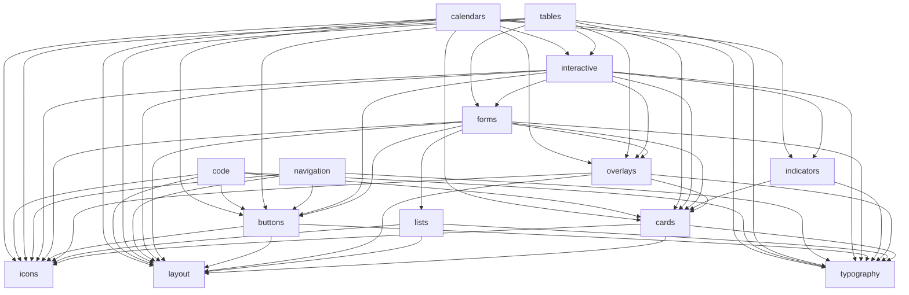

# Component Dependency Graph

Which UIID UI components rely on other UI components. An arrow `A --> B` means
"A uses B". Derived from the `@uiid` entries in each package's `package.json`.

Non-visual packages (`tokens`, `utils`) and the `design-system` barrel
are excluded — this is only the UI component library.

`layout`, `typography`, and `icons` are the primitives; they get the most incoming
arrows because almost everything is built on them.

## Notes

- Cycle-free — `overlays` uses `cards`, `cards` uses only primitives, and nothing
  points back up. `buttons` no longer depends on `overlays`: Tooltip was dropped as
  a Button dependency, so the two are now independent.
- `layout`, `typography`, and `icons` are leaves — they rely on no other UI
  component. (`layout` composes shared text styles from `@uiid/tokens`, so it no
  longer depends on `typography`.)
- To regenerate, inspect the `@uiid/*` entries in each `packages/*/package.json`,
  dropping `tokens` and `utils`.
