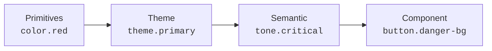
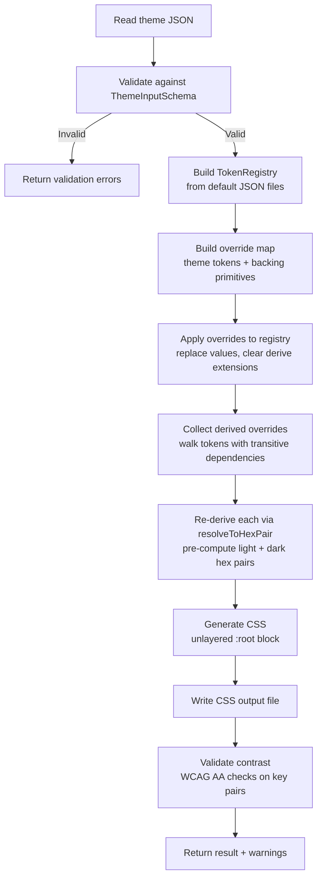

# Theme Architecture Guide

> Internal guide for contributors and maintainers. For the consumer-facing theming guide, see [`docs/guides/theming.md`](../guides/theming.md).

---

## Overview

The theming system lets users supply a minimal color palette and have the entire token cascade — shade scale, tone variants, component tokens — adapt automatically. It's built on three principles:

1. **Build-time resolution** — all derived values are pre-computed to static `light-dark(#hex, #hex)` pairs
2. **Schema as conversion target** — the theme input schema is designed for converters (VSCode, Figma, etc.), not just hand-authoring
3. **Contrast validation** — every generated theme is checked against WCAG AA thresholds before output

---

## Token Cascade

Themes sit between primitives and semantic tokens in the token hierarchy. The cascade flows in one direction:



When a user overrides `theme.primary`, everything downstream re-derives automatically. The user never touches semantic or component tokens.

### Shade scale

The shade scale is a 12-step neutral ramp generated from two anchor colors: `white` and `black`.

| Token | Role | Default |
|-------|------|---------|
| `shade.background` | Page background | `light-dark({white}, {black})` |
| `shade.foreground` | Body text | `light-dark({black}, {white})` |
| `shade.1` – `shade.12` | Neutral steps | Mixed at fixed ratios |

Each step mixes foreground into background at a specific ratio in OKLCH color space:

```
Step:   1     2     3     4     5     6     7     8     9     10    11    12
Ratio:  0.03  0.07  0.12  0.18  0.26  0.36  0.50  0.62  0.72  0.82  0.90  0.96
```

Named aliases map to specific steps:

| Alias | Step |
|-------|------|
| `shade.surface` | `shade.2` |
| `shade.accent` | `shade.3` |
| `shade.halftone` | `shade.7` |
| `shade.muted` | `shade.9` |

When a theme overrides `white` and `black`, all 12 shade steps are re-derived using the same ratios and the new anchors.

### Theme variant derivation

Every theme token automatically gets three derived variants at build time:

| Variant | Derivation | Use case |
|---------|-----------|----------|
| `-surface` | 25% theme color mixed with shade background | Tinted background |
| `-border` | 40% theme color mixed with shade background | Borders, dividers |
| `-foreground` | 60% theme color mixed with shade foreground | Text on surfaces |

Example: `theme.primary: #0077cc` produces:
- `--theme-primary-surface: light-dark(#c0dff2, #0e2a42)`
- `--theme-primary-border: light-dark(#8cc4e8, #143d5e)`
- `--theme-primary-foreground: light-dark(#0a5a99, #5eaee0)`

---

## Generation Pipeline

The theme generator lives in `packages/themes/src/generator/generate-theme.ts`. Here's the full pipeline:



### Key implementation details

**Override mapping** (`buildOverrides` in `overrides.ts`):
- Maps user hex values to both theme token paths and their backing color primitives
- Example: if `primary: "#0077cc"`, sets both `theme.primary` and the underlying `color.*` primitive
- Missing optional tones fall back to `THEME_DEFAULTS`

**Transitive dependency resolution** (`collectDerivedOverrides`):
- Walks all tokens with `org.uiid.derive` extensions
- Uses recursive dependency tracking to find tokens that transitively depend on any overridden value
- Re-derives each using `resolveToHexPair()` to get pre-computed hex pairs for both modes

**CSS output**:
- Generates an unlayered `:root {}` block (beats layered styles in the cascade)
- Two sections: direct theme token overrides + derived shade/tone token overrides
- Includes timestamp and theme name in a comment header

### Why build-time, not runtime

The original implementation used runtime `color-mix()` in CSS for shade and tone derivation. This was replaced with build-time resolution for three reasons:

1. **Contrast validation** — static hex values can be checked against WCAG thresholds. Runtime `color-mix()` values cannot be introspected by the generator.
2. **Determinism** — identical output every build. No floating-point drift across browsers.
3. **Performance** — the CSS engine picks a light or dark branch from `light-dark()`. No color computation at paint time.

The trade-off is that themes require a build step. A future runtime option could use `color-mix()` for live previews, accepting the loss of contrast validation.

---

## Contrast Validation

After generating CSS, the pipeline validates contrast ratios for key color pairs against WCAG AA thresholds.

### Thresholds

| Context | Minimum ratio | Applies to |
|---------|--------------|------------|
| Normal text | 4.5:1 | Body copy, labels |
| Large text / UI | 3.0:1 | Headings >18px, icons, borders |

### Pairs checked

**Core readability:**
- `foreground` / `background` (4.5:1)

**Tone text on tone surfaces:**
- `positive-foreground` / `positive-surface` (4.5:1)
- `critical-foreground` / `critical-surface` (4.5:1)
- `warning-foreground` / `warning-surface` (4.5:1)
- `info-foreground` / `info-surface` (4.5:1)

**Tone base colors on page background:**
- `positive` / `background` (3.0:1)
- `critical` / `background` (3.0:1)
- `warning` / `background` (3.0:1)
- `info` / `background` (3.0:1)

**Brand colors on page background:**
- `primary` / `background` (3.0:1)
- `secondary` / `background` (3.0:1)

### Warning levels

| Level | Condition | Meaning |
|-------|-----------|---------|
| `error` | ratio < 3.0:1 | Likely unreadable — fails even large text |
| `warning` | ratio < 4.5:1 but >= 3.0:1 | Passes large text, may fail body text |

Validation never blocks generation — the theme is always emitted. Warnings are surfaced in the CLI output and returned programmatically so consumers can decide how to handle them.

### Contrast calculation

Uses WCAG relative luminance formula:

```
relativeLuminance = 0.2126 * linearR + 0.7152 * linearG + 0.0722 * linearB
contrastRatio = (lighter + 0.05) / (darker + 0.05)
```

---

## Color Math

All color mixing happens in OKLCH color space for perceptual uniformity.

### OKLCH mixing algorithm (`computeColorMix`)

1. Parse both hex colors to sRGB `[0-1]`
2. Convert to OKLCH `(L, C, H)`
3. Interpolate each channel: `result = color1 + (color2 - color1) * ratio`
4. Special handling for achromatic colors (chroma < threshold): use the chromatic color's hue
5. Shortest-path hue interpolation (handles wraparound at 360)
6. Convert back to sRGB and hex

### Why OKLCH

OKLCH provides perceptually uniform lightness, which means a 50% mix of two colors looks visually halfway between them. In sRGB, a 50% mix skews toward the darker color because the space isn't perceptually linear. This matters for shade scale generation — the 12 steps should feel evenly spaced.

---

## Theme Input Schema as Conversion Target

The theme input schema was deliberately designed to be minimal and hex-only:

```typescript
{
  name: string       // required
  white: "#hex"      // required — light anchor
  black: "#hex"      // required — dark anchor
  primary: "#hex"    // required — brand primary
  secondary: "#hex"  // required — brand secondary
  positive?: "#hex"  // optional — defaults to #00c565
  warning?: "#hex"   // optional — defaults to #e8b700
  critical?: "#hex"  // optional — defaults to #f9262a
  info?: "#hex"      // optional — defaults to #347eff
}
```

This simplicity is intentional. Any external color source that can produce 4-8 hex values can target this schema. The generator handles all downstream complexity (OKLCH conversion, shade derivation, variant generation, contrast validation).

The VSCode theme converter (`packages/themes/src/vscode/`) is the first proof of this design. It maps ~30 VSCode color keys down to 4-8 UIID fields. Future converters (Figma variables, Tailwind configs, Material themes) would follow the same pattern: extract hex values, map to schema fields, let the generator do the rest.

---

## File Map

| Path | Purpose |
|------|---------|
| `packages/themes/src/schema/theme-input.ts` | Zod schema + defaults |
| `packages/themes/src/generator/generate-theme.ts` | Main pipeline |
| `packages/themes/src/generator/overrides.ts` | Override map builder |
| `packages/themes/src/generator/validate.ts` | Contrast validation |
| `packages/themes/src/utils/color-utils.ts` | OKLCH conversion + mixing |
| `packages/themes/src/vscode/` | VSCode converter |
| `packages/themes/src/presets/` | Example theme JSONs |
| `packages/tokens/src/json/semantic/shade.tokens.json` | Shade scale with derive extensions |
| `packages/tokens/src/json/semantic/tone.tokens.json` | Tone tokens with derive extensions |
| `packages/tokens/transforms/color-utils.js` | Token build color math |
| `scripts/generate-theme.js` | CLI wrapper |
| `scripts/convert-vscode-theme.js` | VSCode CLI wrapper |
